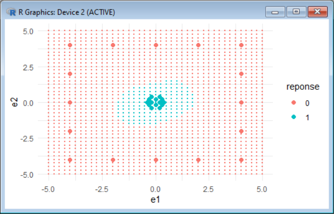
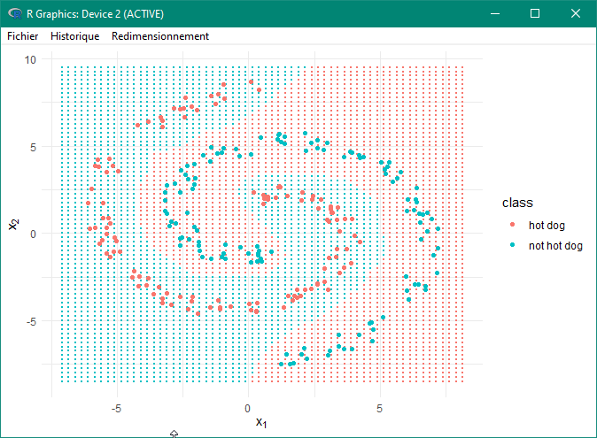

# Réseaux de neurones
### (Code fait pour un devoir en cours)
Réseau de neurones au nombre de neurones réglable. Fonctionne (il me semble) en 3 couches (entrée, traitement, sortie).
Apprentissage programmé, fonctionne sur la descente de gradients et la dérivation en chaîne. A aussi une fonction d'apprentissage par recherche itérative des meilleurs poids, mais elle ne fonctionne pas vraiment (je soupçonne un problème dans mes calculs matriciels...)

Exemple avec 10 neurones sur un schéma assez simple :

Exemple sur une spirale avec 30 neurones :

> Note : J’ai dev ça sur VS Code pour la coloration syntaxique et plein d’autres trucs sympa, mais j’ai fait du copier/coller sur le «shell» R pour exécuter parce que ça ne marchait pas bien depuis VS Code... Donc il se peut que ça marche pas trop bien mais bon en vrai ça devrait être ok...